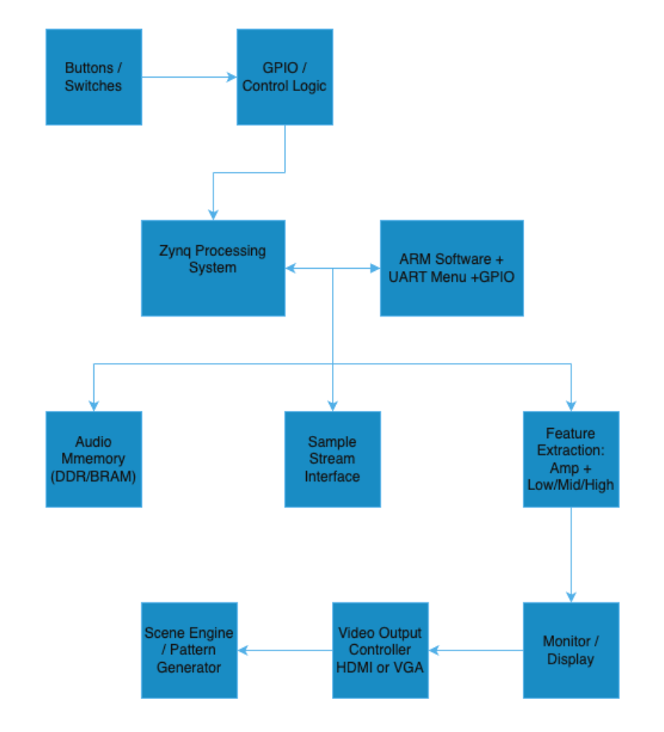

# Reactive Visual Scene Engine

**ECE 520 Final Project**  
**Team:** Andy Ha and Macy Varga  
**Board:** Digilent Zybo Z7-10  
**SoC:** Xilinx Zynq-7010, xc7z010clg400-1  
**Toolchain:** Vivado 2023.1, Vitis 2023.1, Python 3  

## Project Overview

The Reactive Visual Scene Engine is an audio-driven HDMI visualizer built on the Zybo Z7-10. A preloaded audio sample is stored in BRAM, read by custom RTL, processed through amplitude and band energy extraction, and displayed as reactive graphics on an HDMI monitor.

The project demonstrates hardware/software co design using the Zynq Processing System and Programmable Logic. The PL handles audio sample reading, feature extraction, scene generation, VGA timing, and HDMI output. The PS runs a bare-metal Vitis application that provides a UART menu for runtime sensitivity control.

## Features

- 640x480 HDMI output at 60 Hz
- Audio samples streamed from BRAM at 22.05 kHz
- RTL feature extraction:
  - amplitude envelope
  - low band energy
  - mid band energy
  - high band energy
- Four visual scenes:
  - Loudness Pulse
  - Bass Bars
  - Treble Flash
  - Tri Band EQ
- Quad view mode showing all four scenes at once
- Freeze mode for inspecting output
- UART menu for sensitivity tuning
- AXI Lite custom control IP
- AXI GPIO for switch/button readback
- Post implementation timing met

## System Architecture



Audio path:

Audio Samples in BRAM  
→ Audio Sample Reader  
→ Feature Extraction  
→ Scene Engine  
→ VGA Timing / RGB-to-DVI  
→ HDMI Monitor  

Control path:

Zynq PS / UART Menu  
→ AXI SmartConnect  
→ Scene Control AXI-Lite IP  
→ Sensitivity Register  
→ Scene Engine  

## PS / PL Partitioning

| System Part | Function |
|---|---|
| Programmable Logic | BRAM audio reading, amplitude detection, band energy extraction, scene rendering, VGA timing, HDMI output |
| Processing System | UART menu, sensitivity updates, AXI register access, switch/status readback |

## Hardware Design

The PL design is written in Verilog and organized into audio, feature extraction, scene engine, video, AXI IP, and top-level modules.

Important RTL modules:

| Module | Purpose |
|---|---|
| `audio_sample_reader.v` | Reads audio samples from BRAM at 22.05 kHz |
| `amplitude_detector.v` | Extracts the amplitude envelope |
| `band_energy.v` | Computes low, mid, and high energy bands |
| `scene_engine_top.v` | Selects between scenes and handles quad-view mode |
| `scene_loudness_pulse.v` | Scene 0 |
| `scene_bass_bars.v` | Scene 1 |
| `scene_treble_flash.v` | Scene 2 |
| `scene_tri_band_eq.v` | Scene 3 |
| `vga_sync.v` | Generates 640x480 video timing |
| `scene_ctrl_v1_0.v` | Custom AXI Lite scene control IP |

## Software Design

The PS software is a bare metal Vitis application. It provides a UART menu at 115200 baud and writes sensitivity settings to the custom AXI-Lite register interface.

Important software files:

| File | Purpose |
|---|---|
| `main.c` | Initializes the system and runs the main loop |
| `uart_menu.c` | Handles UART user commands |
| `scene_ctrl.c` | Provides AXI register read/write helpers |
| `button_handler.c` | Reads switch/button status through AXI GPIO |

## User Controls

| Control | Function |
|---|---|
| `SW[1:0]` | Selects one of four scenes |
| `SW2` | Enables quad view mode |
| `SW3` | Freezes the visual output |
| UART option 1 | Sets sensitivity |
| UART option 2 | Shows current status |
| UART option 3 | Resets sensitivity |

## Visual Scenes

| Scene | Name | Description |
|---|---|---|
| 0 | Loudness Pulse | Orange rectangle grows and brightens with amplitude |
| 1 | Bass Bars | Green bars rise from the bottom based on low band energy |
| 2 | Treble Flash | Cyan edge flashes and magenta center glow react to high/mid energy |
| 3 | Tri-Band EQ | Red, green, and blue stacked bars show low, mid, and high bands |

In quad view mode, all four scenes are shown at once in a 2x2 grid.

## Verification and Testing

The project was verified in multiple phases.

### Phase 1: Audio Pipeline Simulation

| Testbench | Result |
|---|---|
| `tb_amplitude_detector` | PASS |
| `tb_band_energy` | PASS |
| `tb_feature_extraction_top` | PASS |

### Phase 2: Scene Simulation

| Testbench | Result |
|---|---|
| `tb_scene_loudness_pulse` | PASS |
| `tb_scene_bass_bars` | PASS |
| `tb_scene_treble_flash` | PASS |
| `tb_scene_tri_band_eq` | PASS |
| `tb_scene_engine_top` | PASS |

### Phase 3: Hardware Verification

The design was programmed on the Zybo Z7-10 and verified through HDMI output. LED0 confirms MMCM lock, LED1 confirms active video, and the monitor displays the selected visual scene.

## Resource Utilization

| Resource | Used | Available | Utilization |
|---|---:|---:|---:|
| LUTs | 5,885 | 17,600 | 33.4% |
| FFs | 5,808 | 35,200 | 16.5% |
| BRAM | 29 | 60 | 48.3% |
| DSP48E1 | 2 | 80 | 2.5% |

## Timing Results

Post implementation timing was met after adding a two-stage pipeline to the band-energy module and applying implementation-only CDC false-path constraints.

## Build and Run Instructions

### 1. Open the Vivado Project

Open:

`phase3_integration/phase3_integration.xpr`

### 2. Generate Bitstream

In Vivado:

```tcl
reset_run synth_1
launch_runs synth_1 -jobs 4
wait_on_run synth_1
reset_run impl_1
launch_runs impl_1 -to_step write_bitstream -jobs 4
wait_on_run impl_1
```

### 3. Program the Board

Use Vivado Hardware Manager to program the Zybo Z7-10 with:

`phase3_integration/phase3_integration.runs/impl_1/reactive_scene_top_ps.bit`

### 4. Run the Vitis Application

Open the Vitis workspace and launch the bare-metal application on hardware.

Serial terminal settings:

| Setting | Value |
|---|---|
| Baud | 115200 |
| Data bits | 8 |
| Parity | None |
| Stop bits | 1 |

## Demo Procedure

1. Power the Zybo Z7-10 and connect HDMI.
2. Program the FPGA.
3. Confirm LED0 and LED1 are on.
4. Use `SW[1:0]` to switch between the four scenes.
5. Turn on `SW2` to show quad-view mode.
6. Turn on `SW3` to freeze the display.
7. Open the UART terminal and adjust sensitivity.

## Known Challenges

- BRAM had to be configured in Standalone mode for COE initialization.
- The original band-energy path caused timing issues due to a long CARRY4 chain.
- The Treble Flash scene needed its own freeze input because it had an internal counter.
- AXI GPIO software had to match the actual Vivado block design channel setup.

## Conclusion

This project successfully demonstrates a Zynq-based audio-reactive visual engine. The final design uses custom RTL in the PL for deterministic audio feature extraction and video rendering, while the PS provides runtime control through UART and AXI-Lite. The system was verified through simulations, timing analysis, and hardware testing on the Zybo Z7-10.
